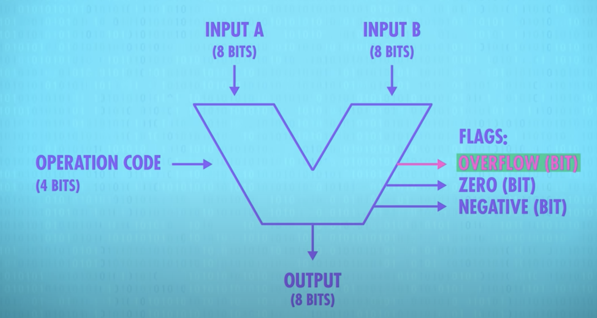
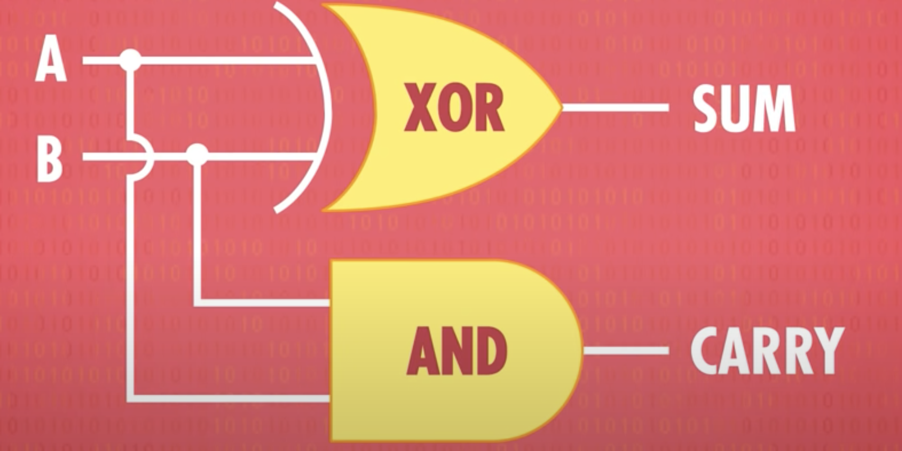
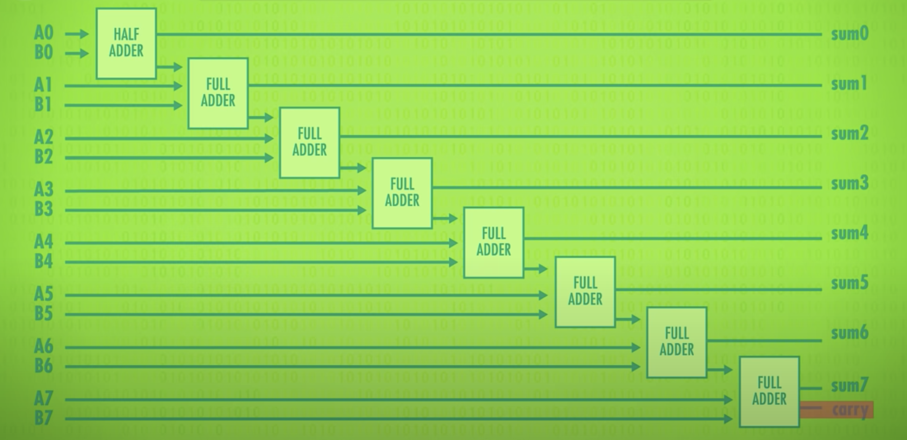

# 从零实现操作系统系列

## 1. 控制电流的开关

无论是晶体管、真空管、继电器，他们在基本层面上都可以视为控制电流流动的开关。他们的功能就是控制电流的流动，从而实现信号的放大、逻辑运算、电路控制等等

另外，晶体管的开关速度(也叫切换速度或者频率)是非常重要的,开关速度指的是晶体管从导通到截止的时间，通常都是以纳秒(ns)为单位，开关的速度也决定了晶体管可以执行的逻辑运算和控制操作的速度


## 2. 逻辑门

单个晶体管我们有一个输入和输出,如果我们输入是on,那么输出也会是on,如果我们输入是off,则输出也会是off

```
Input ---- (晶体管) ---- Output
```

Not Gate

```
Input ----(晶体管) ---- Output
             |
            电阻
             |
             地
```
晶体管的输入端与输入信号相连,输出端连接到电阻和地,当输入信号为高电平的时候,晶体管导通,晶体管中的电流大量流向地线,所以输出为低电平;当输入信号为低电平的时候,虽然电流无法流动到地线,但是输出线的电流会被接通,所以输出为高电平

And Gate

```
current ---------------- Output
            |        |
          晶体管A   晶体管B
            |        |
            |        |
            |        |
            |        |
          InputA    InputB
```

在这个电路中，两个输入信号分别连接到两个晶体管的基极。当且仅当两个输入信号都为高电平的时候，两个晶体管都导通，输出端


Or Gate


```
Input A
|
|----(晶体管)------\
|                  \
|                  (输出)
|                  /
|----(晶体管)-----/
Input B
```

接收两个输入信号，并且只要其中一个或者两个输入信号为高电平，输出信号就为高电平;只有当两个输入信号都为低电平的时候,输出信号才为低电平

> 那么,其实其他的逻辑门都大同小异了,基本上我们可以通过这些电路来实现基础的逻辑门


## 3. ALU 

拥有了逻辑门，我们就可以使用逻辑门来创建我们的计算单元了

```
Input A ----\
            |
            |--------\
Input B ----|        |
            |   ALU  |------- Output
Control ----|        |
            |--------/
            |
```

- InputA (8bit) 操作数
- InputB (8bit) 操作数
- Control (4bit) 操作符
- Flags: overflow(bit) / zero(bit) / Negative(bit)
- Output (8bit) 输出结果




半加器

```
Input A ----\
            |
            |--------\
Input B ----|        |
            |---XOR--|-- Output Sum
            |        |
            |--------/
            |
            |---AND--|-- Output Carry
            /
Ground ---/
```

在这个示意图中，输入A和输入B分别与XOR门和AND门相连。输出Sum取决于XOR门的输出,而输出Carry取决于AND门的输出,这个半加器用来执行单位加法运算操作



全加器

一个全加器是一个逻辑电路，它对两个输入（A和B）以及前一个电路的进位（Cin）进行操作，产生一个输出和一个进位输出。全加器由两个半加器和一个OR门组成。半加器处理A和B输入，产生它们的和，而OR门处理半加器的输出和前一个电路的进位，产生最终的和输出。


> 简单的说就是两个半加器进位进行OR运算后得出最终的进位，AB产生和之后跟进位相加得出相加结果

**8位全加器实例**



其实,减法器、逻辑运算的原理大同小异,都是使用一些基础的逻辑门来实现的

## 4. 寄存器 & 内存

ALU每次我们输入,很快我们就可以得到我们的结果,但是计算机是需要将数据保存起来的,我们虽然已经有了算数的功能(输入、输出)

最终的结果永远都是保存在内存中,无论CPU经历了怎么样的一个过程,最终的电路状态都要保存在RAM中

## 5. CPU

代码其实就是存储在存储器(内存、硬盘)中的有序的电压的高低

那么,其实我们给CPU输入的实际也就是一堆有序电压的高低,00010010101111......

所谓的"指令",其实就是某个机器码,当你带着这些电信号输入到CPU中去的时候,这些命令码会改变CPU内部一堆"开关"的状态,以激活不同的电路,而数据就是被送入到这个被指令激活的电路中保存起来的

CPU一通电，我们就可以理解为它就是在不断的取值执行过程中,不断的激活不同的电路,在不同的时钟周期中,CPU会依次执行取指、译码、执行者三个阶段,中断是一个特殊情况,当发生中断的时候CPU会中断当前的执行流程，处理完中断请求后，恢复到原来的执行状态(操作系统级别的软中断/硬件硬中断)

软中断: 系统调用/异常
硬中断: 鼠标、键盘、网卡、IO设备

***1. ALU***

- 数据输入INPUT:用于输入要进行逻辑运算的数据
- 数据输出OUTPUT:用户输出ALU执行完毕的结果 
- 控制端CONTROL:用于输入控制信号,控制ALU进行特定的算术逻辑操作,例如加法、减法等算数运算或者逻辑运算等
- ALU寄存器:用来存放ALU的计算结果,方便控制器读取到RAM或者CPU寄存器中


> CPU控制单元给ALU提供数据输入,InputA and InputB ,提供操作码Control,使用ALU接口进行运算,并将ALU计算出来的结果放入寄存器

***2. 寄存器 / RAM***

- 数据输入Data Input : 用户输入写入寄存器的数据
- 地址线Address Lines : 选择访问的寄存器
- 时钟输入端Clock Input : 用于接收时钟信号,上升沿的时候输出最新的结果
- 读写输入端Enable Input: 控制寄存器内部允许或禁止写入
- 数据输出Data Output : 用于输出从寄存器中读取的数据

> CPU控制单元将给寄存器提供数据输入,地址线,时钟输入以及读写输入端等一系列的数据,并将结果写入寄存器


***3.控制单元***


- 第一步 -- 取指


CPU控制单元(Control Unit)首先读取PC寄存器中的地址,并将PC寄存器中的地址通过地址总线(address bus)传递给RAM,前提是CPU打开了控制总线(control bus), set代表的是设置,enable代表的读,当enable打开的情况下,内存会将对应内存地址上的任何数据都传送给CPU,通过数据总线(data bus),CPU将当前执行的指令放到指令寄存器中(IR)


假设CPU需要保存数据(写),那么它会首先输出一个地址信号(address bus),然后输出一个数据内容(data bus),并打开set信号,这样CPU就会将数据写入内存中

从这里可以看出,控制单元跟RAM/寄存器之间是通过地址总线、数据总线、控制总线相连接的


- 第二步 -- 译码 (Decode)

CPU控制器从IR(指令寄存器)中取出需要执行的指令Code, 寻找到我需要做的操作之后,发送控制信号到不同的电路中(Data Path)

- 第三步 -- 执行(Execute)

在执行阶段，控制单元负责根据译码阶段生成的控制信号，协调并控制 ALU（算术逻辑单元）以执行具体的操作，例如算术运算、逻辑运算、数据传输等。控制单元会将操作数从寄存器或内存中获取，并将它们传递给 ALU 进行计算。同时，控制单元还负责生成其他必要的控制信号，以确保指令的正确执行。

- 第四步 -- 写回

CPU将计算结果存回寄存器或者将寄存器的值存入内存


- last -- PC+1,不断循环


