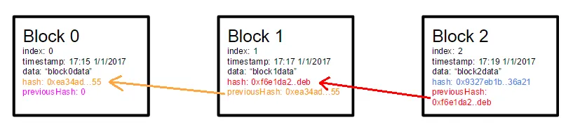
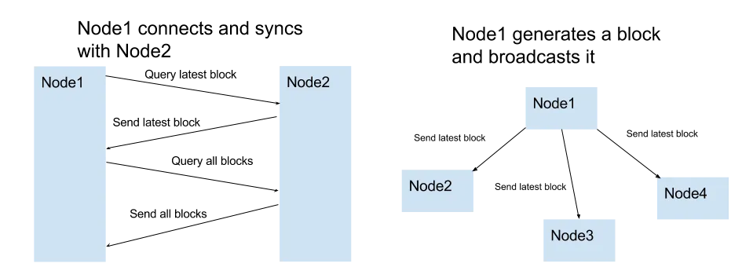

# 从0开始200行代码实现区块链

## 块结构

第一个合乎逻辑的步骤是决定块结构。为了让事情尽可能的简单，我们就包括最必要的元素: 索引、时间戳、数据、哈希和先前的哈希



```js

class Block {
    constructor(index,previousHash,timestamp,data,hash){
        this.index = index;
        this.previousHash = previousHash.toString();
        this.timestamp = timestamp;
        this.data = data;
        this.hash = has.toString();
    }
}
```

## 块哈希

```js
var calculateHash = (index,previousHash,timestamp,data) => {
    return CryptoJS.SHA256(index + previousHash + timestamp + data).toString();
}
```

## 生成区块

要生成一个块，我们必须知道前一个块的哈希并创建所需内容的其余部分(= 索引、哈希、数据和时间戳).块数据是由最终用户提供的

新的块  = 前一个块的hash + 当前块索引、哈希、数据、时间戳

```js

var generateNextBlock = (blockData) => {
    var previousBlock = getLatesBlock();
    var nextIndex = previousBlock.index + 1;
    var nextTimestamp = new Date().getTime() / 1000;
    var nextHash = calculateHash(nextIndex,previousBlock.hash,nextTimestamp,blockData);
    return new Block(nextIndex, previousBlock.hash, nextTimestamp, blockData, nextHash)
}
```


## 存储块

内存中的js数组用来存储区块链.区块链中的第一个块始终是所谓的创世块，它是硬编码的

```js
var getGenesisBlock = () => {
    return new Block(0, "0", 1465154705, "my genesis block!!", "816534932c2b7154836da6afc367695e6337db8a921823784c14378abed4f7d7");
};

var blockchain = [getGenesisBlock()];

```

## 验证块的完整性

在任何给定时间，我们必须能够验证一个区块或者区块链在完整性方面是否有效。尤其是当我们从其他节点接收到新块并且必须决定是否接收他们的时候

```js
var isValidNewBlock = (newBlock,previousBlock) => {
    if (previousBlock.index + 1 !== newBlock.index) {
        console.log('invalid index');
        return false;
    } else if (previousBlock.hash !== newBlock.previousHash) {
        console.log('invalid previoushash');
        return false;
    } else if (calculateHashForBlock(newBlock) !== newBlock.hash) {
        console.log('invalid hash: ' + calculateHashForBlock(newBlock) + ' ' + newBlock.hash);
        return false;
    }
}

```

## 选择最长链

在给定的时间内，链中应该始终只有一组明确的块。在发生冲突的情况下，例如，两个节点都生成编号为72的块，我们选择具有最长块数的链。

```js
var replaceChain = (newBlocks) => {
    if(isVaildChain(newBlocks) && newBlocks.length > blockchain.length){
        console.log('Received blockchain is valid. Replacing current blockchain with received blockchain');
        blockchain = newBlocks;
        broadcast(responseLatestMsg());
    } else {
        console.log('Received blockchain invalid');
    }
}

```

## 与其他节点通信

- 当节点生成新块时，它会将其广播到网络
- 当一个节点连接到一个新的对等节点时，它会查询最新的块
- 当一个节点遇到一个索引大于当前已知块的块时，它要么将该块添加到其当前链中，要么查询完整的区块链。




## 控制节点

用户必须能够以某种方式控制节点。这是通过设置 HTTP 服务器来完成的

```js
var initHttpServer = () => {
    var app = express();
    app.use(bodyParser.json());

    app.get('/blocks', (req, res) => res.send(JSON.stringify(blockchain)));
    app.post('/mineBlock', (req, res) => {
        var newBlock = generateNextBlock(req.body.data);
        addBlock(newBlock);
        broadcast(responseLatestMsg());
        console.log('block added: ' + JSON.stringify(newBlock));
        res.send();
    });
    app.get('/peers', (req, res) => {
        res.send(sockets.map(s => s._socket.remoteAddress + ':' + s._socket.remotePort));
    });
    app.post('/addPeer', (req, res) => {
        connectToPeers([req.body.peer]);
        res.send();
    });
    app.listen(http_port, () => console.log('Listening http on port: ' + http_port));
};

```

- 列出所有块
- 使用用户提供的内容创建一个新块
- 列出或添加同行

控制节点最简单的方法就是curl 

```shell
#get all blocks from the node
curl http://localhost:3001/blocks
```

## 网络

节点实际是暴露了两台服务器： 一台供用户控制节点，一台用于节点间的点对点通信


> 没有挖矿算法，只是区块链最基础的功能
